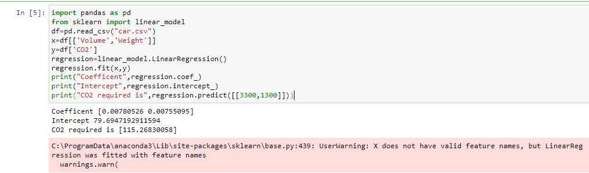

# Implementation of Multivariate Linear Regression
## Aim
To write a python program to implement multivariate linear regression and predict the output.
## Equipment’s required:
1.	Hardware – PCs
2.	Anaconda – Python 3.7 Installation / Moodle-Code Runner
## Algorithm:
### Step1
Load data from car.csv.

### Step2
 Define features (Volume, Weight) and target (CO2).
 
### Step3
Train a linear regression model.

### Step4
 Print coefficients, intercept, and predict CO2 for [3300, 1300]

## Program:
```
import pandas as pd
from sklearn import linear_model
df=pd.read_csv("car.csv")
x=df[['Volume','Weight']]
y=df['CO2']
regression=linear_model.LinearRegression()
regression.fit(x,y)
print("Coefficent",regression.coef_)
print("Intercept",regression.intercept_)
print("CO2 required is",regression.predict([[3300,1300]]))


```
## Output:

### Insert your output



## Result
Thus the multivariate linear regression is implemented and predicted the output using python program.
